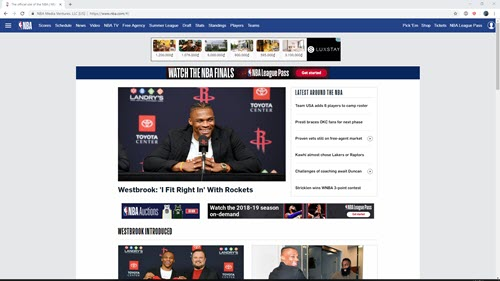
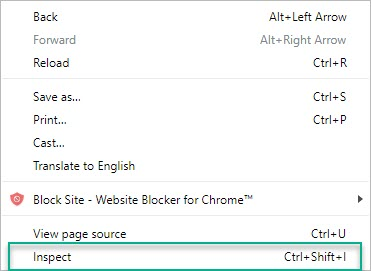
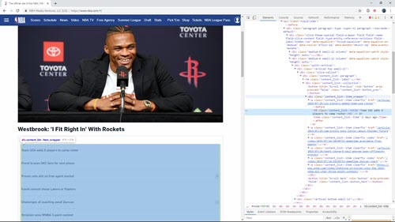
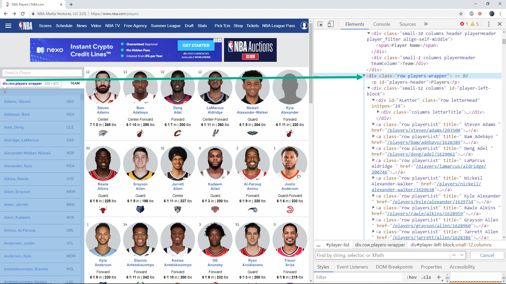
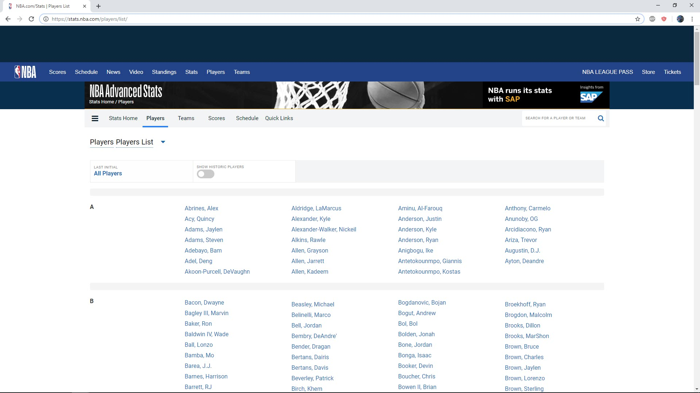
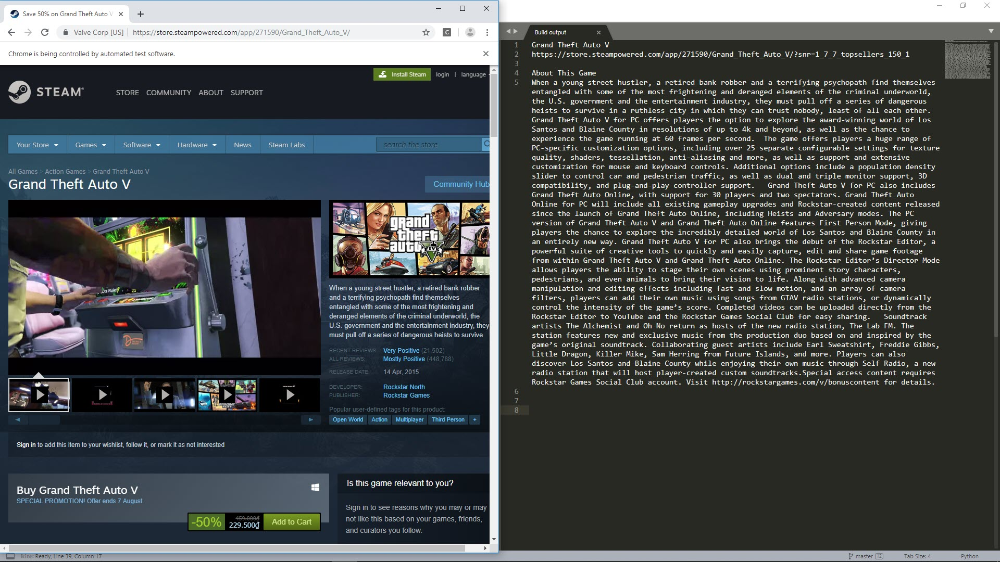
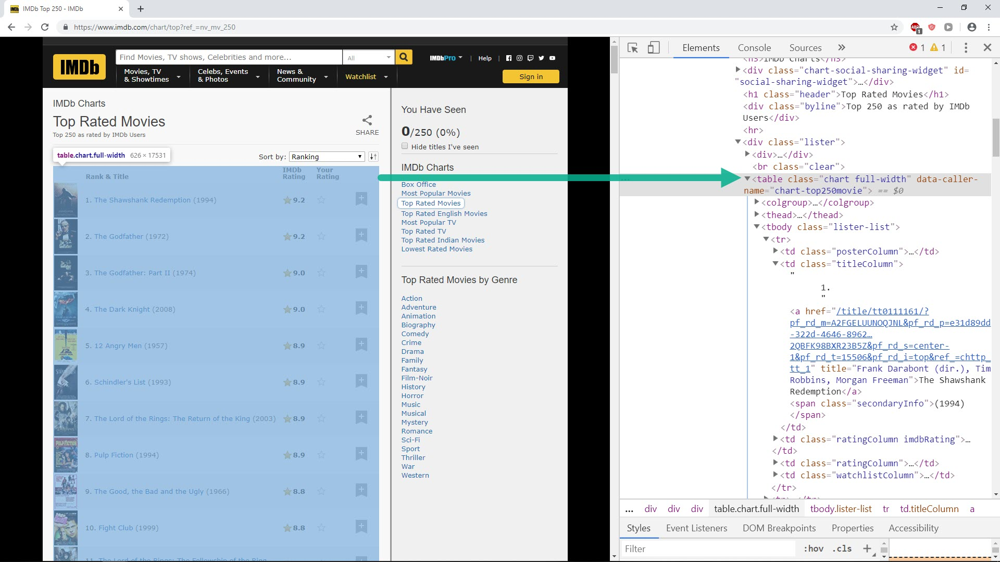
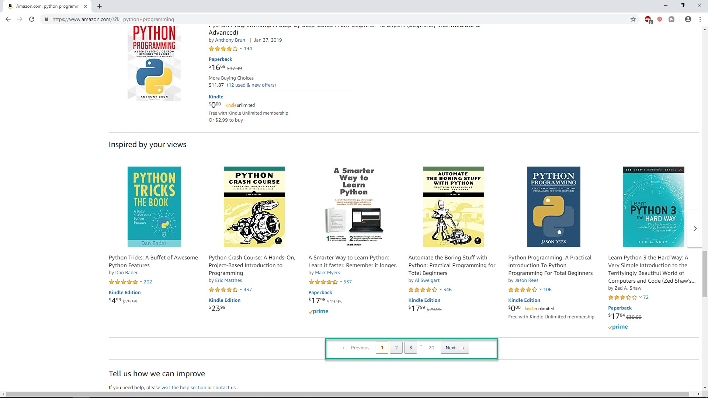

#### The Big Picture : Scrape any Website in 4 Steps


In this chapter, we overview on common web scraping steps. Actually this is really simple process.

**Step 1** : Web scraping always start with a web page and data items which we want to scrape out from the page. At first step, we need to understand web page then find out  HTML tags contain our wanted data. Result from this step will be used in final step to actually scrape data.


**Step 2** : Wanted Data is located inside HTML page.  We download HTML to local. We use Selenium for download.


**Step 3** : After have HTML page, we use Beautiful Soup to parse HTML content in to object. Then we search for HTML tags which contain our data.


**Step 4** : Final step is scraping data and store it to file  or database. In this book we will make it simple by store data to file.


#### Selenium

We use <a href="https://www.seleniumhq.org/" target="_blank">Selenium</a> to control browser and download HTML content. 

Why we not just use simple library like requests to download HTML content ?. 

Have 2 reasons:

* Many modern web page use a lot of JavaScript for dynamic HTML render, requests package could not render HTML from JavaScript.
* In some web pages, in order access wanted data, we need to do actions like : login, click link to navigate. Selenium can do that perfectly.


#### Beautiful Soup

We need [Beautiful Soup](https://www.crummy.com/software/BeautifulSoup/bs4/doc/) to parse HTML in to object. Beautiful Soup provide functions help us to search HTML tags inside HTML object.

After have HTML tags, final step just about access wanted data and save.---
layout: default
---

#### Inspecting Web Page with Chrome Developer Tool

At step 1, we will go in deep detail how to use `Chrome Developer Tool` to inspect web page.

At end of this chapter you will understand how to do inspecting web page and have clear strategies to scrape data from HTML page.

We will use [NBA](https://www.nba.com/#/) for our demo, let access NBA with Chrome browser.




#### Chrome Developer Tool

We will use `Chrome Developer Tool` to inspect NBA home page. Now mouse over web page then right click, then select `Inspect` from context menu.




A panel will open and show up corespond HTML content of NBA home page. We saw that HTML show on a tree structure and very easy to navigate from tag to tag.




#### Example 1 : Inspect NBA News

Suppose we want to scrape all ***title and link*** inside the box "LATEST AROUND THE NBA".

Move mouse up and down on HTML tree view to findout what web page items is selected when we select corespond tag.

We found that when mouse select `div` tag which has class name `content_list--collection`, the whole news area will be selected. So the first step should be find the `div` tag with class name `content_list--collection`.


Now after know the `div` tag which contain all news, we need continue go to each new inside the box.

Continue try to moving the mouse around, we will see that titles and link are inside `a` tag which have class name `content_list--item clearfix`.


So for conclusion we have following strategy to scrape all new title inside "LATEST AROUND THE NBA"

* Search for `div` tag which has class name `content_list--collection`.
* Inside above `div` tag, search for all `a` tags which have class name `content_list--item clearfix`.


#### Example 2 : Inspect NBA Players

Suppose we want to ***scrape detail data for each players*** on link https://www.nba.com/players.

From web page we see that we want to find out HTML tag which contain all player name. Right click mouse and select `inspect` , then move mouse around we know that we need to find `div` tag with class name `players-wrapper`.




Inside the `div` we found above, we nee do to find all `a` tag with class name `playerList` which contain name and link to detail data for each player.


From link for each player above, we go to detail page, for example we go to detail page for player Steven Adams at reference. In this page, we need to find `div` tag with class name `nba-player-vitals` which contain all detail informations


That it, now let sumary again strategy to get detail information for each players:

* From url https://www.nba.com/players search for `div` tag which has class name `players-wrapper`.
* Inside `div` above, search for all `a` tags which has class name `playerList`.
* Which each `a` tags above, we scrape `href` attribute to have link to detail information for each player.
* Inside each detail url, for example https://www.nba.com/players/steven/adams/203500 we search for `div` tag which has class name `nba-player-vitals` . Inside this `div` tag contain all detail data we need.---
layout: default
---

#### Download HTML Page Content

At step 2,  we will download HTML page content with selenium package. And try to control Chrome web browser in two mode normal mode and headness mode.

#### Installation

First of all we need to install selenium package in order to control browser with python. Let open command prompt on Windows (terminal in Mac) and typing in.

```python
pip install selenium
```


To control Chrome, We also need to download [Chrome driver](http://chromedriver.chromium.org/home) . Let choose stable version and place some where in your local.


#### Control browser in normal mode

We will use `webdriver` to control Chrome browser, so the first step is import `webdriver` from `selenium` package.

```python
from selenium import webdriver
```

Then we want to create `Chrome` object, note that we need to specify abolute path where we place downloaded `chrome driver` above.

```python
driver_path = r'C:\chromedriver_win32\chromedriver.exe'
driver = webdriver.Chrome(executable_path=driver_path)
```

Now with `driver` object, we could download HTML content with `get` function. Support we want to download HTML from https://www.nba.com/. You could see that a Chome browser instance is created then NBA home page is loaded.

```python
driver.get('https://www.nba.com/')
```

Now to access HTML content, we just need to use propery `page_source`

```python
print(driver.page_source)
```

At here we complete download HTML content and print it out,  at final step we should `close` driver so you will see Chrome driver close.

```python
driver.close()
```

That it, let summary every thing again

```python
# import webdriver
from selenium import webdriver

# create Chrome object
driver_path = r'C:\chromedriver_win32\chromedriver.exe'
driver = webdriver.Chrome(executable_path=driver_path)

# access url
driver.get('https://www.nba.com/')

# access HTML content
print(driver.page_source)

# close browser
driver.close()
```


#### Control browser in headness mode

Headness mode mean we still create a Chrome browser instance to download HTML but Chrome browser ***do not show up***.

Why we do not want browser to show up ?

The answer is in `headness` mode every thing will faster and our scraping script consume less cpu, ram resource. So after we build up script completely, we should running it in `headness` mode. We do normal mode when we want to debug and develop script.

To run brower in `headness` mode, the first step we need to create `ChromeOptions` object and set value to `headless` property.

```python
# create option for headness mode
options = webdriver.ChromeOptions()
options.headless = True
```

Now when we create `Chrome` object, we need put in `option` parameter.

```python
# create Chrome object with option
driver_path = r'C:\chromedriver_win32\chromedriver.exe'
driver = webdriver.Chrome(executable_path=driver_path,
                          options=options)
```

That it, let summary every thing again

```python
# import webdriver
from selenium import webdriver

# create option for headness mode
options = webdriver.ChromeOptions()
options.headless = True

# create Chrome object
driver_path = r'C:\chromedriver_win32\chromedriver.exe'
driver = webdriver.Chrome(executable_path=driver_path,
                          options=options)

# access url
driver.get('https://www.nba.com/')

# access HTML content
print(driver.page_source)

# close browser
driver.close()
```---
layout: default
---

### Create Soup and Search for Tag

At step 3, after have HTML content downloaded with selenium, we use `beautiful soup` to parse the HTML and start search for tags which contain our wanted data.

#### Install Beautiful Soup

We need to install `beautiful soup` package before using it.

```python
pip install beautifulsoup4
```

#### Create Soup Object

For easy of explain, we will use a predefine HTML content as following code.  When we do actual web scraping, step 2 will provide HTML content with `driver.page_source`

```python
# import beautifulsoup object
from bs4 import BeautifulSoup

# predefine a html content
html = """
<html>
<head>
	<title>The Dormouse's story</title>
</head>
<body>
	<p class="title">
		<b>The Dormouse's story</b>
	</p>
	<p class="story">
		Once upon a time there were three little sisters. And their names were
		<a href="http://example.com/elsie" class="sister" id="link1">Elsie</a>,
		<a href="http://example.com/lacie" class="sister" id="link2">Lacie</a> and
		<a href="http://example.com/tillie" class="sister" id="link3">Tillie</a>;
		and they lived at the bottom of a well.
	</p>
	<p class="story">...</p>
/</body>
</html>
"""
# create soup object by HTML content
soup = BeautifulSoup(html, 'lxml')
```

#### Search for First Tag by Name

To search the first tag by name, we use function `find` and pass in the tag name. For example following code return the first `p` tag

```python
first_p_tag = soup.find('p')
print(first_p_tag)
```

Result print out

```python
"""
<p class="title">
	<b>The Dormouse's story</b>
</p>
"""
```

#### Search for All Tags by Name

To search for all tags by name, we use function `find_all` then pass in the tag name. For example following code return all `a` tags in a list.

```python
a_tags = soup.find_all('a')
print(a_tags)
```

Result when print out

```python
"""
[
<a class="sister" href="http://example.com/elsie" id="link1">Elsie</a>, 
<a class="sister" href="http://example.com/lacie" id="link2">Lacie</a>, 
<a class="sister" href="http://example.com/tillie" id="link3">Tillie</a>
]
"""
```

#### Search with Tag Name and Class Attribute

In real project, many time we want to search for a tag with specific class name. To do that we put in tag name and `class_` parameter.

```python
p_tag = soup.find('p', class_ = 'story')
print(p_tag)
```

Above code will return the first `p` tag which have `class` is "story"

```python
"""
<p class="story">
	Once upon a time there were three little sisters; and their names were
	<a class="sister" href="http://example.com/elsie" id="link1">Elsie</a>,
	<a class="sister" href="http://example.com/lacie" id="link2">Lacie</a> and
	<a class="sister" href="http://example.com/tillie" id="link3">Tillie</a>;
	and they lived at the bottom of a well.
</p>
"""
```

#### Search with Tag Name and Other Attribute

Beside of using `class` attribute for search, we could use any other attribute. To do that we put in tag name and attribute parameter with grammar `{'attribute_name': attribute_value}`

For example following code will find first `a` tag which have `id` is "link1"

```python
a = soup.find('a', {'id':'link1'})
print(a)
```

And it will return

```python
"""
<a class="sister" href="http://example.com/elsie" id="link1">Elsie</a>
"""
```

#### Search with Tag Name and Text Inside

Another way to search is using tag name and text inside that tag. To do that we use `string` parameter.

For example following code will return all `a` tag which has text inside is "Elsie"

```python
a_elsie = soup.find_all('a', string = 'Elsie')
print(a_elsie)
```

And it will return

```python
"""
[<a class="sister" href="http://example.com/elsie" id="link1">Elsie</a>]
"""
```


#### Search Scope

You could see that HTML content page is structured in tree. So after find out the parent tag, we can find out child inside that parent.

For example following code will return the first `b` tag inside the first `p` tag.

```python
first_p = soup.find('p')
first_b_inside_first_p = first_p.find('b')

print(first_b_inside_first_p)
```

And it print out

```python
"""
<b>The Dormouse's story</b>
"""
```---
layout: default
---

#### Scrape Data from Tag

Congratulations, so you come to the final step. And at this step we will harvest out result.

For easy of demo, let continue using the following soup.

```python
# import beautifulsoup object
from bs4 import BeautifulSoup

# predefine a html content
html = """
<html>
<head>
	<title>The Dormouse's story</title>
</head>
<body>
	<p class="title">
		<b>The Dormouse's story</b>
	</p>
	<p class="story">
		Once upon a time there were three little sisters. And their names were
		<a href="http://example.com/elsie" class="sister" id="link1">Elsie</a>,
		<a href="http://example.com/lacie" class="sister" id="link2">Lacie</a> and
		<a href="http://example.com/tillie" class="sister" id="link3">Tillie</a>;
		and they lived at the bottom of a well.
	</p>
	<p class="story">...</p>
/</body>
</html>
"""
# create soup object by HTML content
soup = BeautifulSoup(html, 'lxml')
```

#### Scrape for text

To scrape the text inside a tag we just need to use grammar `tagname.text`

As following code example

```python
p = soup.find('p')
print(p.text)
```

will return result

```python
"""
The Dormouse's story
"""
```


#### Scrape for link

To scrape the link inside `a` tag, we just need to access attribute `href` 

Following code will print out all link inside a tags.

```python
a_tags = soup.find_all('a')
for a in a_tags:
	print(a['href'])
```

And we have result

```python
"""
http://example.com/elsie
http://example.com/lacie
http://example.com/tillie
"""
```


---
layout: default
---

#### NBA projects introduction

[NBA](nba.com) is popular site when you want to to find information about men's professional basketball league in North America. In this chapter we will do 4 difference missions to scraping data on this site.

* scrape name of all players

* scrape name and detail link of all players

* scrape detail information of all players

* scrape image of all players

  

#### Mission 1 : scrape name of all active player

Let access url https://stats.nba.com/players/list/ , you will see full list of player order in alphabet list.




Right click and select 'Inspect' you will open chrome developer tool panel


Now move the mouse around and find the tag which contain all names inside it. You will find out that is `div` tag with `class` name is `stats-player-list`


Now mouse over one name and inspect, you will see that it inside `li` tag with class `players-list__name`


So after inspection we have following strategy to scrape all name.

* search for `div` tag with `class` is `stats-player-list`
* search all `li` tags with class `players-list__name` inside above `div` tag
* scrape text inside each `li` tag above

Now let really do it

```python
from selenium import webdriver
from bs4 import BeautifulSoup

driver = webdriver.Chrome(executable_path=r'C:\chromedriver_win32\chromedriver.exe')

url = 'https://stats.nba.com/players/list/'
driver.get(url)

soup = BeautifulSoup(driver.page_source, 'lxml')
div = soup.find('div', class_= 'stats-player-list')

for a in div.find_all('a'):
	print(a.text)

driver.quit()
```

And at out put you will have 638 players

```python
Abrines, Alex
Acy, Quincy
Adams, Jaylen
Adams, Steven
Adebayo, Bam
Adel, Deng
Akoon-Purcell, DeVaughn
Aldridge, LaMarcus
Alexander, Kyle
...
```


#### Mission 2 : scrape name and detail link of all active player (try it your self)

In this mission we scrape name and correspond link to detail information of that player.

Final result should look like

```python
Abrines, Alex
/player/203518/


Acy, Quincy
/player/203112/


Adams, Jaylen
/player/1629121/
```


####  Mission 3 : scrape detail information for each player (try it your self)

When click to detail link, you will know player detail information


In this mission, we will need to scrape detail data for each player like : name, PTS, REB, AST, PIE

The result should be

```python
name :  Abrines, Alex
link :  https://stats.gleague.nba.com/player/203518/
pts :  0.0
reb :  0.0
ast :  0.0
pie :  0.0


name :  Acy, Quincy
link :  https://stats.gleague.nba.com/player/203112/
pts :  21.7
reb :  8.0
ast :  1.3
pie :  12.0
    
...
```

<video width="700" height="500" controls>  
    <source src="images/detail.mp4" type="video/mp4">
</video>


#### Mission 4 : scrape image for all players (try it your self)

Now we want to get image for each player


Result should as following video


<video width="700" height="500" controls>  
    <source src="images/player_image.mp4" type="video/mp4">
</video>---
layout: default
---

#### Steam projects

Steam is a video game digital distribution platform developed by Valve Corporation. We have 2 mission when scrape data from Steam

* Scrape top selling items
* Scrape top selling items with detail information description
* Login to steam before doing scraping

#### Mission 1 : scrape top selling items

Let access [this url](https://store.steampowered.com/search/?filter=topsellers)

We will see a table list out the top seller


Now our job is scrape title and link of top selling at first page.

Let's do some inspecting and we found that `div` contain all top selling items has `id=search_result_container` 


And then each game is inside `a` tag with `class` is `search_result_row`


And inside each game to get the game tile, we need to find for `span` tag with class `title`.

 


That it, now let do the code.

```python
from selenium import webdriver
from bs4 import BeautifulSoup
import requests

driver = webdriver.Chrome(executable_path=r'C:\chromedriver_win32\chromedriver.exe')

def top_seller():
	# search web scraping
	url = 'https://store.steampowered.com/search/?filter=topsellers&os=win'
	driver.get(url)

	soup = BeautifulSoup(driver.page_source, 'lxml')

	# search for div contain all game
	div = soup.find('div', {'id':'search_result_container'})

	# search for a contain one game
	for a in div.find_all('a', class_='search_result_row'):

		# search for title
		span_name = a.find('span', class_='title')
		print(span_name.text)
		print(a['href'])
		print('\n')

top_seller()

driver.close()
```

and when running, we should see result

```python
"""
Grand Theft Auto V
https://store.steampowered.com/app/271590/Grand_Theft_Auto_V/?snr=1_7_7_topsellers_150_1

Oxygen Not Included
https://store.steampowered.com/app/457140/Oxygen_Not_Included/?snr=1_7_7_topsellers_150_1

Slay the Spire
https://store.steampowered.com/app/646570/Slay_the_Spire/?snr=1_7_7_topsellers_150_1
"""
```


#### Mission 2 : scrape top selling items with detail information (try it your self)

Try click to one game item, we will go to detail page. In this page have session to have detail information


Let scrape this section for each game. Please try this your self first

When running your code result should some thing like below video




#### Mission 3 : login to steam before do scraping (try it your self)

In mission 2 you will see from result that some of game require you above age of 18 in order to view description.

To solve this issue we will try to login to steam before doing scraping.

---
layout: default
---

#### IMDb projects

IMDb (Internet Movie Database) is an online database of information related to films, television programs, home videos, video games, and streaming content online – including cast, production crew and personal biographies, plot summaries, trivia, fan and critical reviews, and ratings.

We will do following tasks when scrape IMDb site :

* Scrape list of best ever movies
* Scrape best movies with detail information
* Scrape large posters for best movies

#### Mission 1 : scrape list of best ever movies

Access this [url](https://www.imdb.com/chart/top?ref_=nv_mv_250) , a list of 250 best ever movies will show up. In this mission, we will try to scrape all of this movie title.


Let do some inspection, we easy see that entire list is inside `table` tag with class `chart`



And each individual movie is inside `td` tag with class `titleColumn`


So we have following code to scrape all movies title

```python
from bs4 import  BeautifulSoup
from selenium import webdriver

chrome_driver_path = r'C:\chromedriver_win32\chromedriver.exe'
driver = webdriver.Chrome(executable_path=chrome_driver_path)

url = 'https://www.imdb.com/chart/top?ref_=nv_mv_250'
driver.get(url)
soup = BeautifulSoup(driver.page_source,'lxml')

# search for table contain all title
table = soup.find('table', class_ = 'chart')

# search for each individual title
for td in table.find_all('td', class_ = 'titleColumn'):
	
	# get title and clean it up
	print(td.text.strip().replace('\n','').replace('      ',''))
```

And then running above code we will have following result

```python
"""
1.The Shawshank Redemption(1994)
2.The Godfather(1972)
3.The Godfather: Part II(1974)
4.The Dark Knight(2008)
5.12 Angry Men(1957)
6.Schindler's List(1993)
7.The Lord of the Rings: The Return of the King(2003)
8.Pulp Fiction(1994)
9.The Good, the Bad and the Ugly(1966)
10.Fight Club(1999)
"""
```


#### Mission 2 : scrape list of best ever movies with detail infor (try it your self)

From above full title we could extract following information

* Rank
* Movie title
* Year of show
* Link to detail page

Let try your self to scrape all above information. And out put print out should as following

```python
"""
rank   :  1
titele :  The Shawshank Redemption
year   :  1994
link   :  /title/tt0111161/?pf_rd_m=A2FGELUUNOQJNL&pf_rd_p=e31d89dd-322d-4646-8962-327b42fe94b1&pf_rd_r=5J8K5RAZ3N1Q80SH0JMQ&pf_rd_s=center-1&pf_rd_t=15506&pf_rd_i=top&ref_=chttp_tt_1


rank   :  2
titele :  The Godfather
year   :  1972
link   :  /title/tt0068646/?pf_rd_m=A2FGELUUNOQJNL&pf_rd_p=e31d89dd-322d-4646-8962-327b42fe94b1&pf_rd_r=5J8K5RAZ3N1Q80SH0JMQ&pf_rd_s=center-1&pf_rd_t=15506&pf_rd_i=top&ref_=chttp_tt_2
"""
```


#### Mission 3 : Scrape large poster for all movies (try it your self)

With each individual movie, when click to detail link, detail page will show up. In detail page contain large poster that we want to scrape in this mission.


Let's try your self to scrape these posters, it will be very interesting. Result should as below

<video width="700" height="500" controls>  
    <source src="images/poster.mp4" type="video/mp4">
</video>

---
layout: default
---

#### Amazon projects

Amazon is largest ecommerce site in the world. We will do following web scraping task on Amazon:

* Scrape book list "python programming", get book title and link to detail page.
* Scrape detail information for each book in side "python programming" list
* Scrape customer comment for each book inside "python programming" list
* Scrape search result from multiple pages

#### Mission 1 : scrape title and detail link

Access the [link](https://www.amazon.com/s/ref=nb_sb_noss_1?url=search-alias%3Daps&field-keywords=python+programming) and you will see a list of python programming book


Let do some inspection on this page, we see that `div` with class `s-result-list` contain all books


Now to acess each book, we see that `a` tag with class `a-link-normal a-text-normal` contain book title and link to detail for each book


So we have following code to scrape book title and link to detail page

```python
from bs4 import BeautifulSoup
from selenium import webdriver

chrome_driver_path = r'C:\chromedriver_win32\chromedriver.exe'
driver = webdriver.Chrome(executable_path=chrome_driver_path)

def get_book_list():
	url = 'https://www.amazon.com/s/ref=nb_sb_noss_1?url=search-alias%3Daps&field-keywords=python+programming'
	driver.get(url)

	soup = BeautifulSoup(driver.page_source, 'lxml')
	div = soup.find('div', class_='s-result-list')

	for a in div.find_all('a', class_ = 'a-link-normal a-text-normal'):
		print('title : ',a.text.replace('\n', ''))
		print('link : ', a['href'])
		print('\n')
		print('\n')

get_book_list()

driver.close()
```

After running we will have book title and link print out as below

```python
"""
title :  Python Crash Course: A Hands-On, Project-Based Introduction to Programming
link :  /Python-Crash-Course-Hands-Project-Based/dp/1593276036/ref=sr_1_1?keywords=python+programming&qid=1564924835&s=gateway&sr=8-1

title :  A Smarter Way to Learn Python: Learn it faster. Remember it longer.
link :  /Smarter-Way-Learn-Python-Remember-ebook/dp/B077Z55G3B/ref=sr_1_2?keywords=python+programming&qid=1564924835&s=gateway&sr=8-2

title :  Python Crash Course, 2nd Edition: A Hands-On, Project-Based Introduction to Programming
link :  /Python-Crash-Course-2nd-Edition/dp/1593279280/ref=sr_1_3?keywords=python+programming&qid=1564924835&s=gateway&sr=8-3
"""
```


#### Mission 2 : scrape detail infor for each book (try it your self)

When click to each book, We will go to detail page, in this page for example we want to scrape for ISBN number and the book description.


When running your code, console result should as below

```python
"""
isbn :   1593276036
description :  Python Crash Course is a fast-paced, thorough introduction to Python that will 
have you writing programs, solving problems, and making things that work in no 
time.In the first half of the book, you’ll learn about basic programming 
concepts, such as lists, dictionaries, classes, and loops, and practice 
writing clean and readable code with exercises for each topic. You’ll also 
learn how to make your programs interactive and how to test your code safely 
before adding it to a project. In the second half of the book, you’ll put your 
new knowledge into practice with three substantial projects: a Space 
Invaders–inspired arcade game, data visualizations with Python’s super-handy 
libraries, and a simple web app you can deploy online.As you work through 
Python Crash Course you’ll learn how to:–Use powerful Python libraries and 
tools, including matplotlib, NumPy, and Pygal–Make 2D games that respond to 
keypresses and mouse clicks, and that grow more difficult as the game 
progresses–Work with data to generate interactive visualizations–Create and 
customize Web apps and deploy them safely online–Deal with mistakes and errors 
so you can solve your own programming problemsIf you’ve been thinking 
seriously about digging into programming, Python Crash Course will get you up 
to speed and have you writing real programs fast. Why wait any longer? Start 
your engines and code!Uses Python 2 and 3
"""
```


#### Mission 3 : scrape customer comment for each book (try it your self)

In this mission, we also scrape inside detail page, but we want to get comment from reader. Just the most valueable comment. It is the top comment.


When running your code it should print out as below

```python
"""
comment :  This book is a life-saver! I'm taking programming courses to complete a 
teaching authorization in computer science and this book is 10x better than 
the required text. Each programming concept is explained well and followed by 
a chunk of code that has a line-by-line narrative explanation of what the code 
does. At the end of each section, there are "Try It Yourself" mini-projects to 
apply your learning. They can take anywhere from 5-45 minutes to complete but 
they are perfect for checking your own understanding of each concept. If/when 
I teach an Intro to Python course, this will be MY required text!
"""
```


#### Mission 4 : scrape book from multiple pages (try it your self)

We could see that search result for "python programming" contain multiple pages (here we see that have 20 pages).

In this mission we will try to get book infor from all pages

 